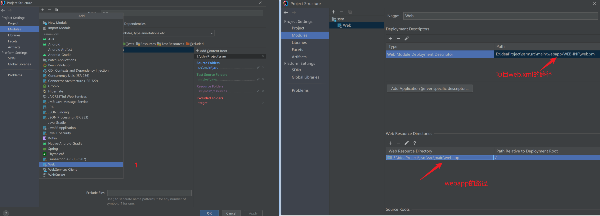

最新ssm整合（idea+maven），做个记录，顺便复习下

## 创建项目

1. 创建maven项目

   

2. 创建webapp文件夹

   

3. 配置Tomcat运行

### 配置文件

整体的项目结构及配置文件

1. web.xml
2. mybatis-config.xml
3. spring.xml
4. springmvc.xml

## 总结
[源码](https://github.com/aguoxing/ssm)

...

参考

- https://cloud.tencent.com/developer/article/1610326
- https://cloud.tencent.com/developer/article/2020828

